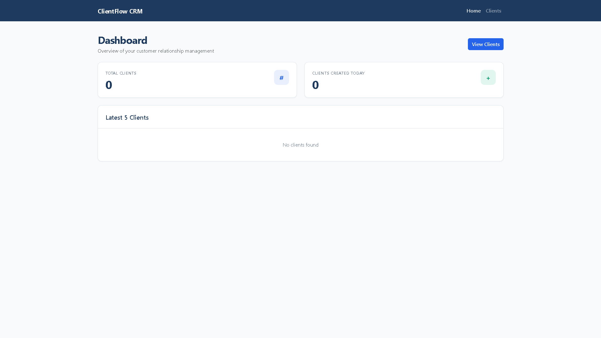
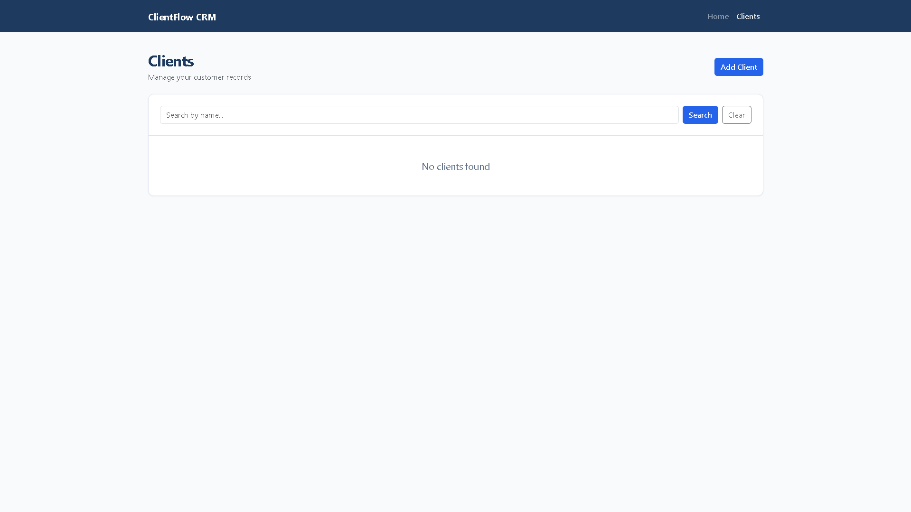
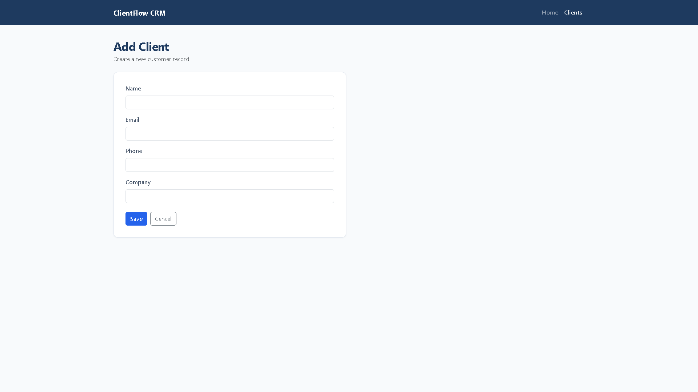
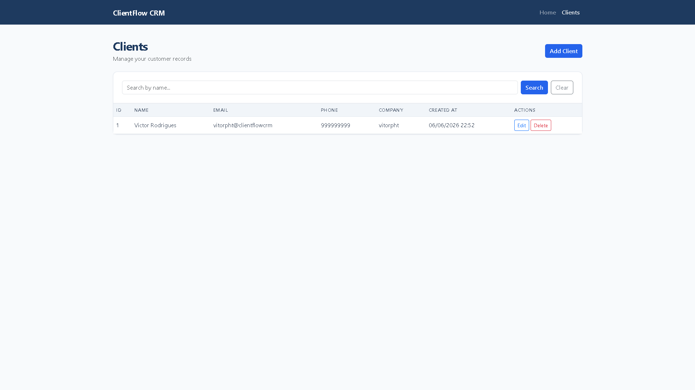

# ClientFlow CRM

**ClientFlow CRM** is a Customer Relationship Management web application for managing client records. Built with Spring Boot and a clean MVC architecture, it provides a professional interface to create, view, update, and delete clients with form validation and responsive design.

---

## Features

- **Create Clients** — Add new customer records through a validated form
- **Update Clients** — Edit existing client information while preserving creation date
- **Delete Clients** — Remove records with Bootstrap confirmation modal
- **Client Validation** — Server-side validation for required fields and email format
- **Responsive Interface** — Mobile-friendly layout powered by Bootstrap 5

---

## Screenshots

### Dashboard



### Clients List



### Create Client



### Edit Client



---

## Technologies

| Category | Stack |
|----------|-------|
| Backend | Java 21, Spring Boot 4 |
| Persistence | Spring Data JPA, Hibernate, SQL (H2) |
| Frontend | HTML5, CSS3, Bootstrap 5, Thymeleaf |
| Tools | Maven, Lombok |

---

## Architecture

The project follows a layered **MVC** structure with clear separation of concerns:

```
Controller  →  Service  →  Repository  →  Database
     ↓
   View (Thymeleaf)
```

| Layer | Responsibility |
|-------|----------------|
| **Controller** | Handles HTTP requests and routes users to views |
| **Service Layer** | Contains business logic and orchestrates operations |
| **Repository Pattern** | Abstracts data access via Spring Data JPA |
| **Model** | JPA entities representing domain objects |

### Project Structure

```
src/main/java/com/vitorpht/clientflowcrm/
├── controller/     # Web layer (ClientController)
├── service/        # Business logic (ClientService)
├── repository/     # Data access (ClientRepository)
└── model/          # Domain entities (Client)

src/main/resources/
├── application.properties
└── templates/      # Thymeleaf views (index, clients, client-form)
```

---

## Getting Started

### Prerequisites

- Java 21 or higher
- Git

### Run the Application

```bash
git clone <repository-url>
cd clientflow-crm
./mvnw spring-boot:run
```

On Windows:

```powershell
cd clientflow-crm
.\mvnw.cmd spring-boot:run
```

The application starts at **http://localhost:8080**

### H2 Console (Development)

| Setting | Value |
|---------|-------|
| URL | http://localhost:8080/h2-console |
| JDBC URL | `jdbc:h2:mem:clientflowcrm` |
| Username | `sa` |
| Password | *(empty)* |

---

## Routes

| Method | Route | Description |
|--------|-------|-------------|
| GET | `/` | Home page |
| GET | `/clients` | List all clients |
| GET | `/clients/new` | Create client form |
| POST | `/clients` | Save new client |
| GET | `/clients/edit/{id}` | Edit client form |
| POST | `/clients/update/{id}` | Update client |
| POST | `/clients/delete/{id}` | Delete client |

---

## License

This project is open source and available for portfolio and educational purposes.

---

**ClientFlow CRM** — Customer Relationship Management System
